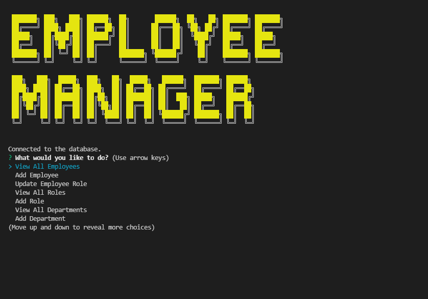

# Employee Manager 

## Description

I created this application to utilize mysql to create and manage employees by department, and role. This application uses inquirer to gather user input data and mysql2 queries to enter that data into tables.
## Table of Contents
- [Installation](#installation)
- [Usage](#usage)
- [License](#license)
- [Contributing](#contributing)
- [Tests](#tests)
- [Questions](#questions)
- [Credits](#credits)

## Installation

To install Employee Manager, the user will need to create a clone of this repository by using the command `git clone` in git bash. The user will then have to open this repository in VSCode. The user will have to have node installed in their vscode.  

[For more information on installing npm](https://docs.npmjs.com/cli/v8/commands/npm-install)

Once cloned open the repo into the user's VSCODE suite and open the app.js with the user's integrated terminal.

Once the terminal is open run the following command `npm i` to install the necessary dependancies.

After the dependancies have been installed, the user will have to login to their mysql using the following command `mysql -u root -p<user-password>`.

After logging into mysql, the user will have to run the following command `source schema.sql` to create the necessary database.

The user will have an option to either seed the database with seed data provided by running the command `source seeds.sql` in mysql,
or the user can use the application without seed data.

Then the user will have to exit out of mysql by running the following command `exit`.

## Usage

[Watch this video for a walkthrough of the application](https://watch.screencastify.com/v/quGM8SVAkifyfJn48iEM)

Now that everything is set up to use the Employee Manager app, within the integrated terminal, run the command `node app.js`.

- The user will be presented with the main menu which contains all the CRUD (Create, Read, Update and Delete) functionality.

--Note, ID's will be automatically assigned to employees, roles, and departments.

- The View All Employees option will present the user with a table of all the data on the current employees.

- The Add Employee option will present the user with a series of questions about the employee, 
(id, first name, last name, the role the employee belongs to, and assign manager).

- The Update Employee Role option will present the user with a list employees to choose from. 
Upon selection, the user will then be prompted to assign a new role to that employee with a list of roles.

- The View All Roles option will present the user with a table of all the roles and their corresponding data (id, role, salary and department.

- The Add Role option will presesnt the user with a series of questions about that new role (name of new role, salary, and what department it belongs to).

- The View All Departments option will present the user with a table of all the departments and their corresponding data (id, and department name)

- The Add Department option will present the user with a prompt to enter the department name.

- The Delete Department, Role, or Employee option will present the user with the options to either delete a Department, Role, or Employee, Upon choosing an option, a list of the chosen option's data will appear. After choosing the corresponding data, that piece of data will be deleted.

- Finally the Quit option will end the application.

### Provided here is a screenshot of the application running

## License

MIT License

Copyright &copy; 2022 Isaac Petersen

Permission is hereby granted, free of charge, to any person obtaining a copy
of this software and associated documentation files (the "Software"), to deal
in the Software without restriction, including without limitation the rights
to use, copy, modify, merge, publish, distribute, sublicense, and/or sell
copies of the Software, and to permit persons to whom the Software is
furnished to do so, subject to the following conditions:

The above copyright notice and this permission notice shall be included in all
copies or substantial portions of the Software.

THE SOFTWARE IS PROVIDED "AS IS", WITHOUT WARRANTY OF ANY KIND, EXPRESS OR
IMPLIED, INCLUDING BUT NOT LIMITED TO THE WARRANTIES OF MERCHANTABILITY,
FITNESS FOR A PARTICULAR PURPOSE AND NONINFRINGEMENT. IN NO EVENT SHALL THE
AUTHORS OR COPYRIGHT HOLDERS BE LIABLE FOR ANY CLAIM, DAMAGES OR OTHER
LIABILITY, WHETHER IN AN ACTION OF CONTRACT, TORT OR OTHERWISE, ARISING FROM,
OUT OF OR IN CONNECTION WITH THE SOFTWARE OR THE USE OR OTHER DEALINGS IN THE
SOFTWARE.

## Contributing

To contribute, please contact me via my email or through github.

## Tests

Tests ran and passed by myself.

## Questions

To contact me, use one of the links below:  
[Github profile](https://www.github.com/idpetersen)  
[Email Me](mailto:isaac.petersen5@gmail.com)

## Credits

Thank you to Sabrina Hanson for collaborating with me on this project. 